[](https://travis-ci.org/IBM/watson-discovery-news)
* English original pattern is [here](./README.md)

# ニュースを検索してトレンドを分析するWatson × Slack bot を構築する

このコードパターンでは、Watson Discovery Serviceを使用してWatson Discovery NewsにアクセスするNode.js Webアプリケーションを構築します。

Watson Discovery Newsは、Watson Discovery Serviceに関連付けられているデフォルトのデータコレクションです。 これは、主に英語のニュースソースのデータセットであり、毎日約30万件の新しい記事とブログが追加され、継続的に更新されています。

ここでは以下のアプリケーションの作成を行います:

* Slackからニュースの検索を行う **SlackBot** を作成します

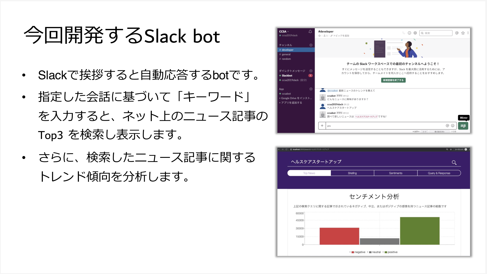
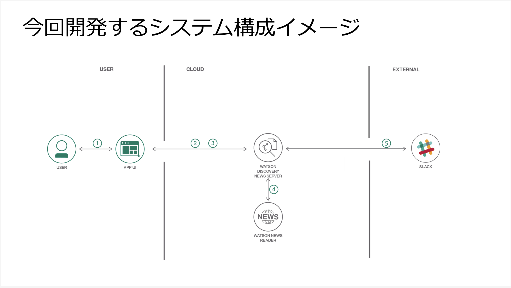

## 開発のステップ
1. Node.jsのインストール
2. Yarnのインストール
3. Visual Studio Codeのインストールと設定
4. GitHubソースコードのクローン
5. IBM Watson Discoveryサービスの作成
6. .envファイル編集
7. Slack [Japan Developer Experience]ワークスペース への参加
8. Slack API Tokenの取得
9. Botアプリの起動
10. Slackチャンネル作成
11. SlackチャンネルへBotの招待
12. Botと会話

# 開発に必要なもの

* [IBM Cloudアカウント](https://ibm.biz/BdzKBB): IBMが提供するクラウドサービス及びクラウドプラットフォーム
* [Watson Discovery](https://www.ibm.com/watson/developercloud/discovery.html): アプリケーションが識別するためのコグニティブ検索およびコンテンツ分析エンジン
* [Node.js](https://nodejs.org/en/) - 拡張可能なアプリケーションを構築するために設計された非同期イベント駆動型JavaScriptランタイム
* [Yarn](https://yarnpkg.com) - node.js用の高速で信頼性が高く安全な依存関係マネージャー
* [Slack](https://slack.com) - チャットボット統合を備えたクラウドベースのチームコラボレーションツールおよびサービスのセット。自分のワークスペースを作成しておいて下さい。


# Watch the Video

[](https://youtu.be/EZGgvci9nC0)

# 開発のステップ

## Node.jsのインストール
[Node.jsサイト](https://nodejs.org/en/)へアクセスする。

1. 「10.16.0 LTS」をクリックしてダウンロードする。
2. ダウンロードしたインストールファイルを開き画面に従ってインストールする。

<p align="center">
  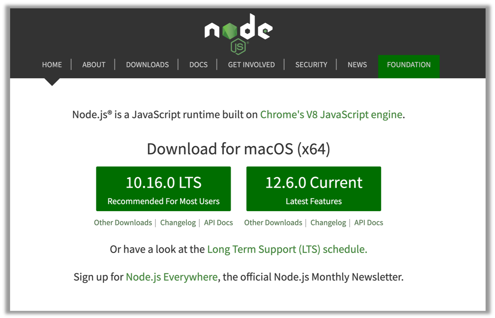
</p>

## yarnのインストール

1. ターミナルを開く。
2. 下記のコマンドを実行しYarnをインストールする。

    ```
    $ brew install yarn
    ```

## Visual Studio Codeのインストール

1. [Visual Studio Codeサイト](http://code.visualstudio.com)へアクセスする。
2. 画面右上の「Download」ボタンをクリックする。

<p align="center">
  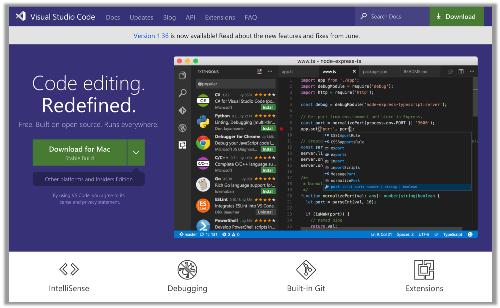
</p>

3. インストールファイルがダウンロードフォルダに格納されたらクリックして開いて、画面に従ってインストールを進める。
4. インストールが完了したらVisual Studio Codeを起動する。
5. 「View(表示)」メニューから「Command Palette (コマンドパレット)」を選択する

<p align="center">
  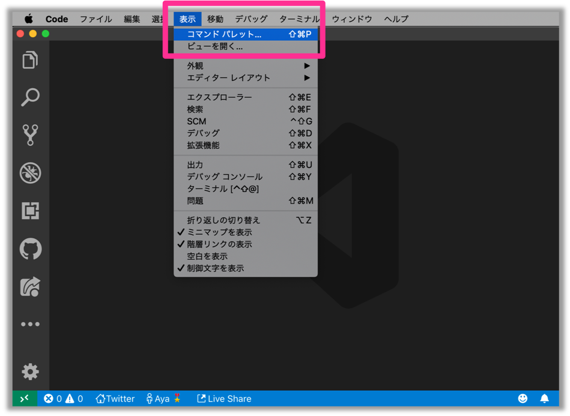
</p>

6. ">"に続いて「path」と入力し、「Shell Command: Install 'code' command in PATH (シェルコマンド:PATH内に’code’コマンドをインストールします)」を選択する。

<p align="center">
  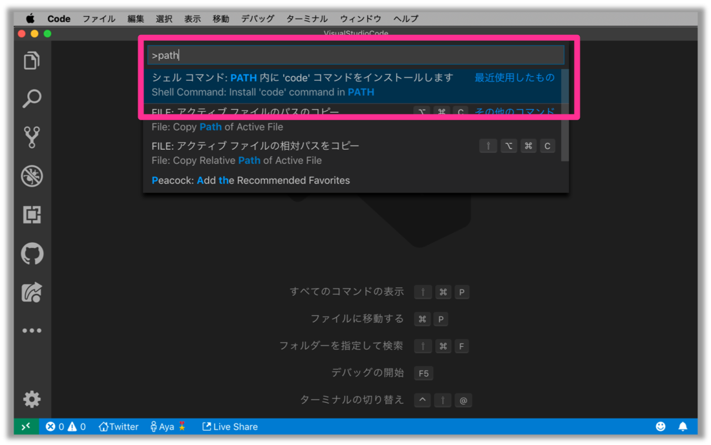
</p>

7. 画面右下に「シェルコマンド’code’がPATHに正常にインストールされました。」通知が表示されればOK。

## ソースコードのダウンロード

1. [GitHubのリポジトリ](https://github.com/taijihagino/watson-discovery-news)へアクセスする。
2. 「Clone or download」ボタンをクリックしてアイコンをクリックしURLをコピーする。

<p align="center">
  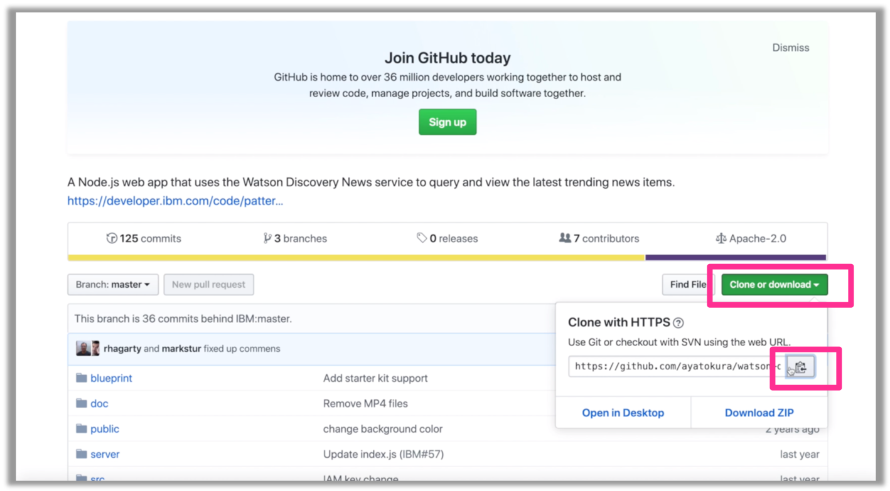
</p>

4. ターミナルから下記のコマンドを実行する。実行場所は任意のフォルダでOK。

    ```
    $ git clone https://github.com/taijihagino/watson-discovery-news.git
    $ cd Watson-discovery-news
    $ ls
    $ rm package-lock.json
    $ yarn
    $ yarn bootstrap
    $ code .
    ```

## Watson Discoveryサービスの新規作成

1. [IBM Cloudサイト](https://ibm.biz/BdzKBB)へアクセスする
2. 「メールアドレス」と「パスワード」を入力し、「ログイン」ボタンをクリックする。
3. IBM Cloudダッシュボード画面上の「カタログ」をクリックし、検索ボックスで「discovery」を
入力して「Discovery」を選択する。

<p align="center">
  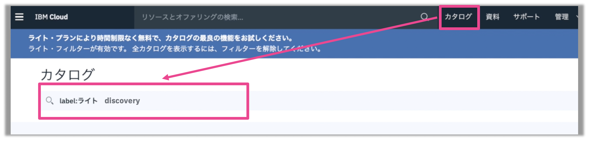
</p>

4. 任意のサービス名を入力する。デプロイする地域/ロケーションの選択は「東京」を選択する

<p align="center">
  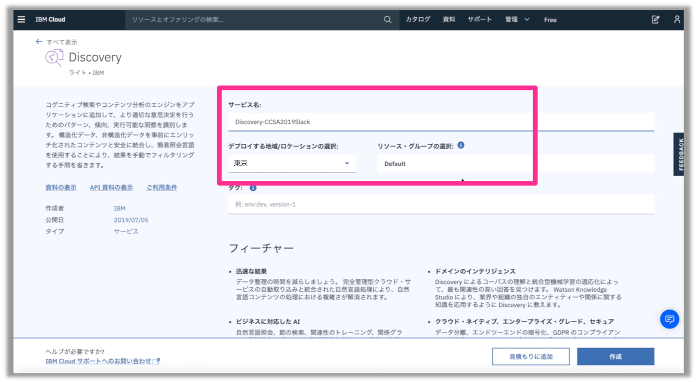
</p>

5. 画面を下にスクロールし無料で作成する場合は「価格プラン」が「ライト」になっていることを確認し、画面下の「作成」ボタンをクリックする。

<p align="center">
  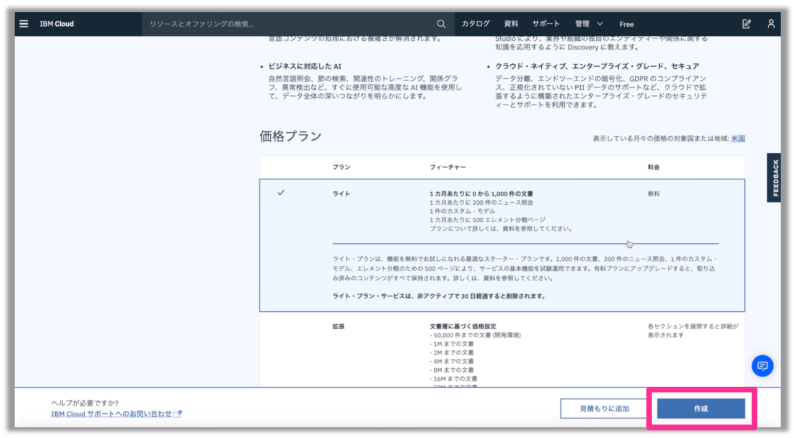
</p>

6. IBM Watson Discoveryのサービスが作成され
状況が「プロビジョンが進行中」と表示されれる。
しばらくすると「プロビジョン済み」に変わる。<br>
※しばらく経過しても状況が変わらない場合にはブラウザを再読み込みして最新情報を取得する。
7. 作成したWatson Discoveryの名前をクリックする。

<p align="center">
  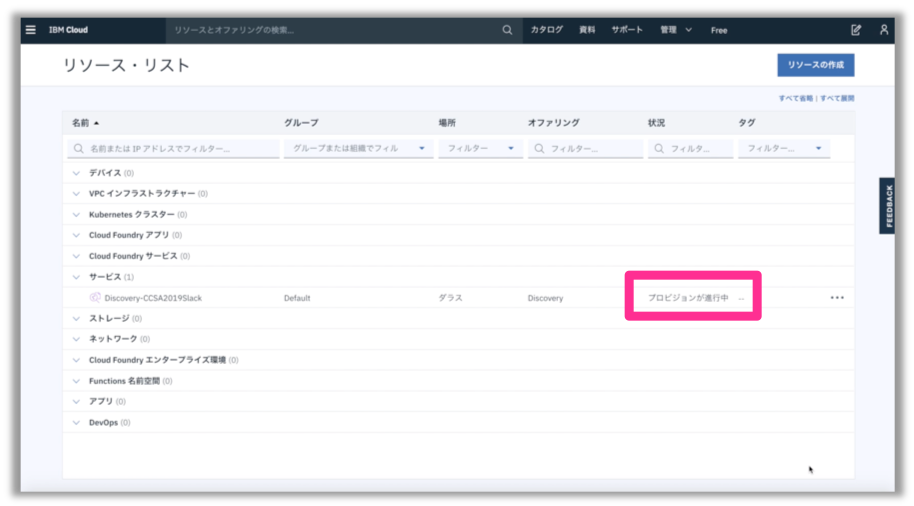
</p>

8. 「資格情報」からURLの横のアイコンをクリックしてコピーする。

<p align="center">
  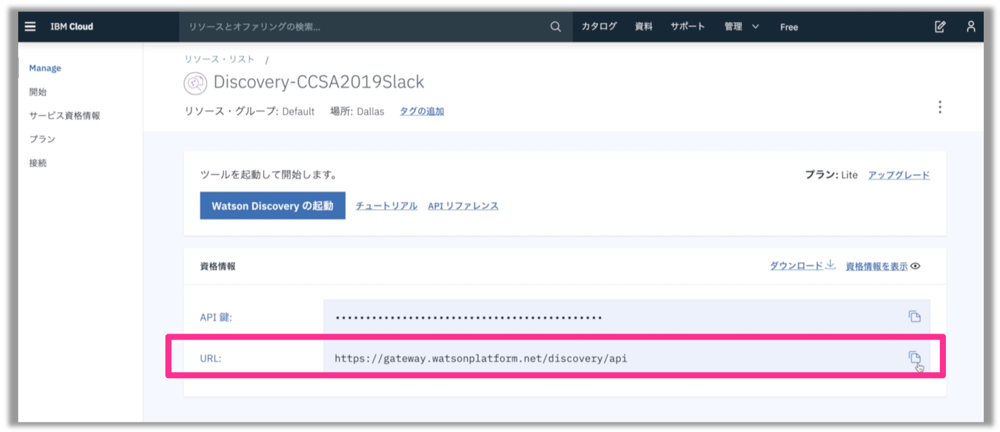
</p>

## .envファイルの編集

1. 先程「code .」コマンドで開いたVS Codeへ戻り、画面左下の「master」をクリックする。

<p align="center">
  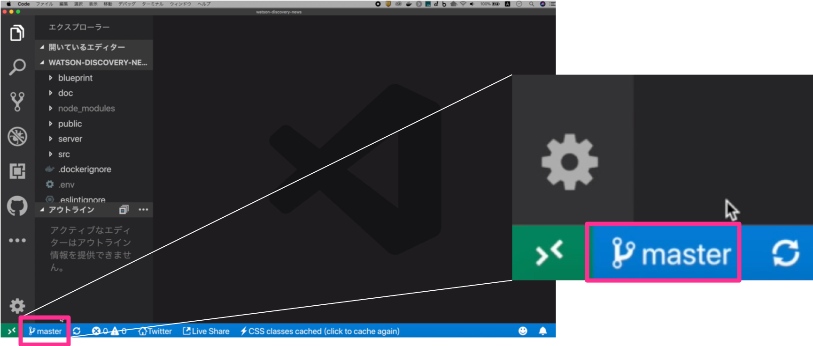
</p>

2. 「チェックアウトする参照を選択」下に表示されたメニューで「origin/Japanese」を選択する。

<p align="center">
  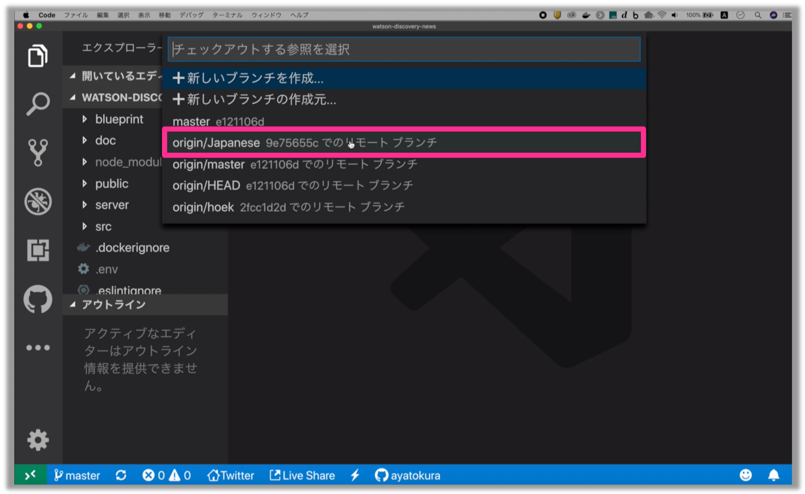
</p>

3. 画面左下の表示が「master」から「Japanese」に変わったことを確認する。

<p align="center">
  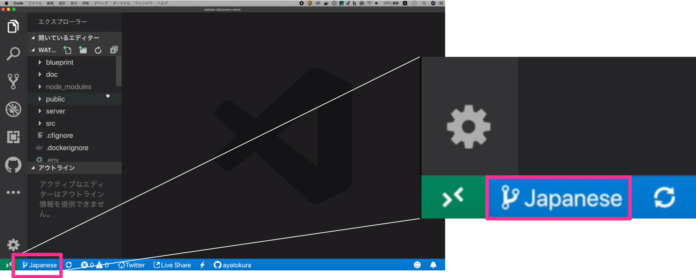
</p>

4. エクスプローラーから.envファイルを探して
クリックし、右側に中身を表示する。

<p align="center">
  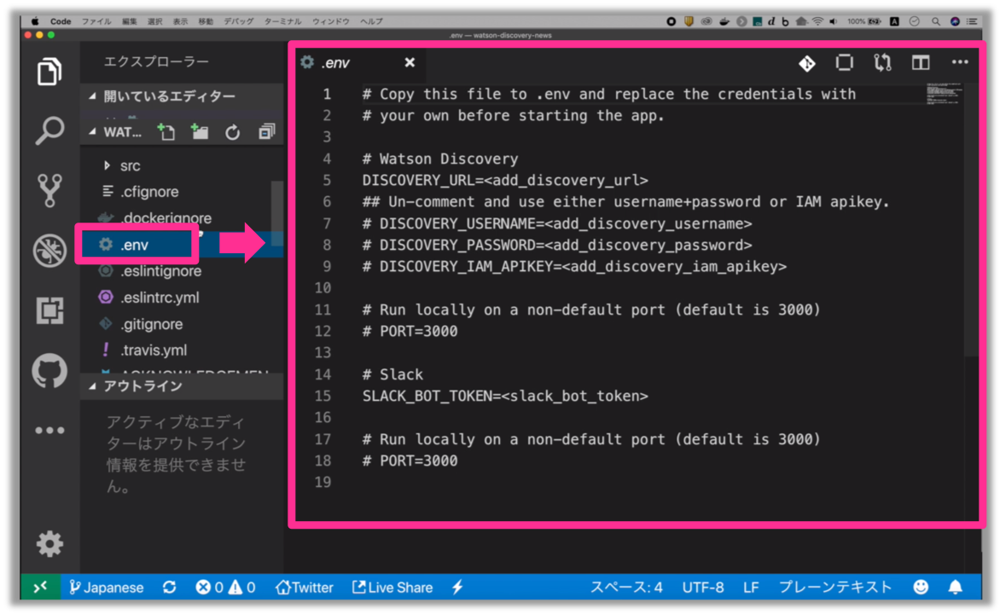
</p>

5. .envファイルの5行目の<add_discovery_url>を削除して先ほどWatson Discovery資格情報で**コピーしたURL**をペーストする。

6. IBM Cloudの画面へ戻り、Watson Discoveryの「資格情報」からAPI鍵の横のアイコンをクリックしてコピーする。
※文字列を確認する場合は「資格情報を表示👁」をクリックする。

<p align="center">
  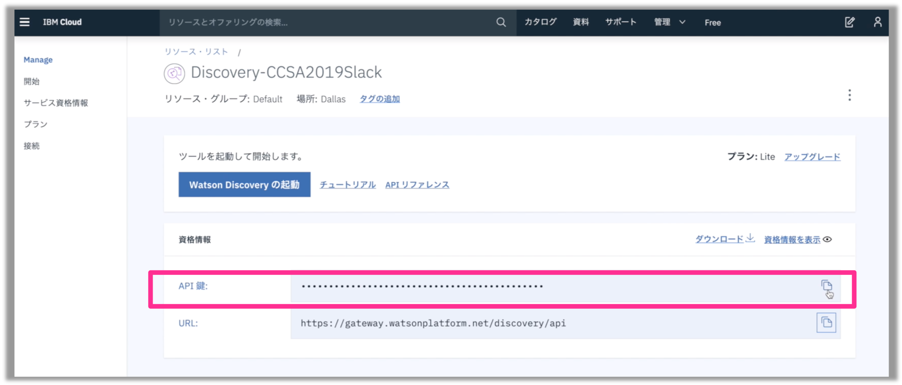
</p>

7. .envファイルの9行目の<add_discovery_iam_apikey>を削除して先ほどコピーしたAPI鍵をペーストする。
8. 9行目の先頭の # を削除する。
9. 12行目の「PORT=3000」と書かれているコードの先頭の # を削除する。

## Slack ワークスペースへの参加

1. 自分で作成したSlackのWorkspaceへアクセスする。
2. Slack画面のワークスペースのタイトルをクリックする。
3. 表示されたメニューから「Manage apps」をクリックする。

<p align="center">
  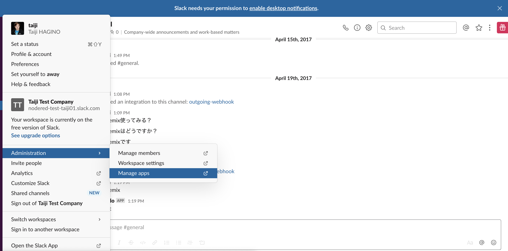
</p>

4. 左側メニューから「Custom Integrations」をクリックし、「Bots」をクリックする。

<p align="center">
  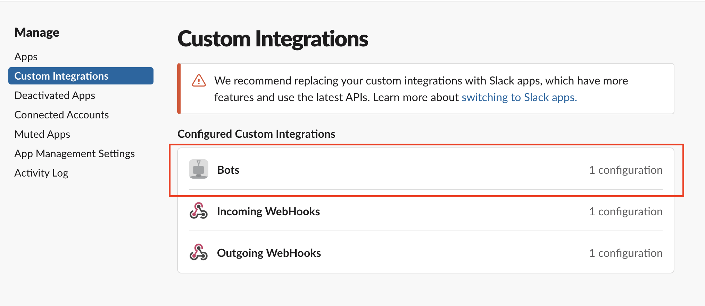
</p>

※ Botsが表示されない場合は、上部の「Brows」から「Get Essential Apps」をクリックし「Bots」を追加する。

<p align="center">
  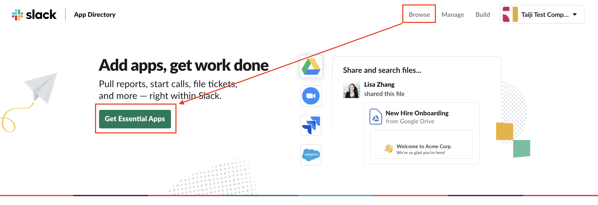
</p>

5. 「Add Configuration」アイコンをクリックする。

<p align="center">
  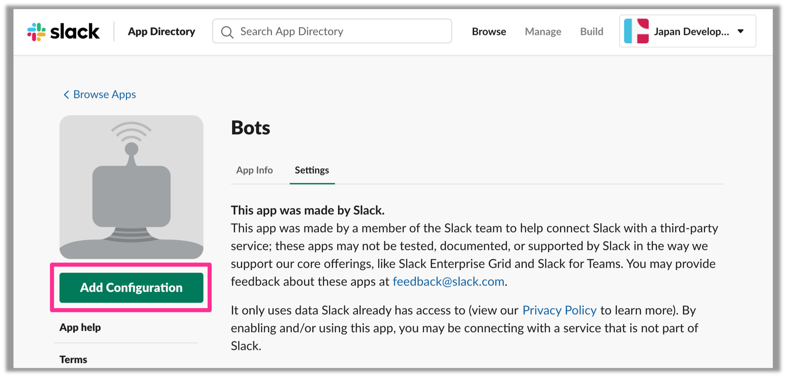
</p>

6. 「Username」に任意の
名前を入力し、「Add bot integration」ボタンを
クリックする.

<p align="center">
  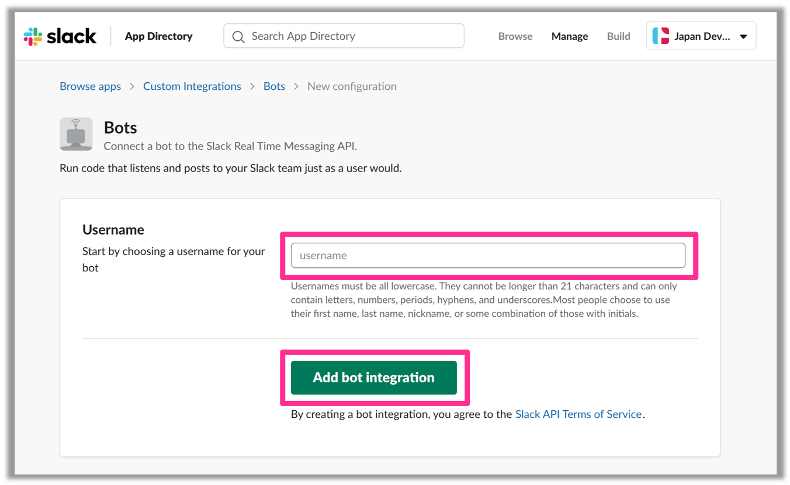
</p>

7. Botサービスが作成され発行された「API Token」の内容をコピーする。

<p align="center">
  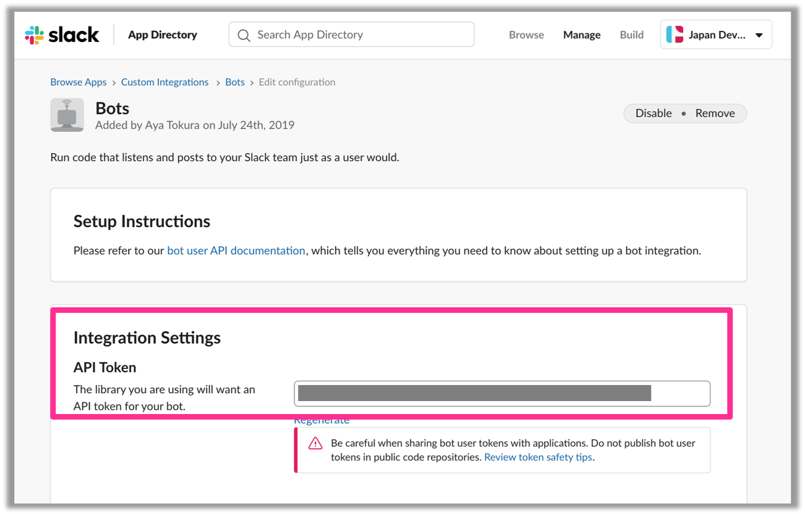
</p>

8. Visual Studio Codeに戻り、.envファイルの15行目の<slack_bot_toke>を削除して先ほどコピーした **Slack bot API Token**をペーストする。
9. 18行目の先頭の # を削除する。
10. 「File(ファイル)」メニューから「Save(保存)」
を選択して、.envファイルの編集した内容を保存する。

## Slack botアプリの起動

1. ターミナルで下記のコマンドを実行し
アプリケーションをローカル上で実行する。

```
$ yarn start
```

2. Webブラウザで「http://localhost:3000/」にアクセスする。
3. 「IBM Watson Discovery Service」画面が表示
されることを確認する。

<p align="center">
  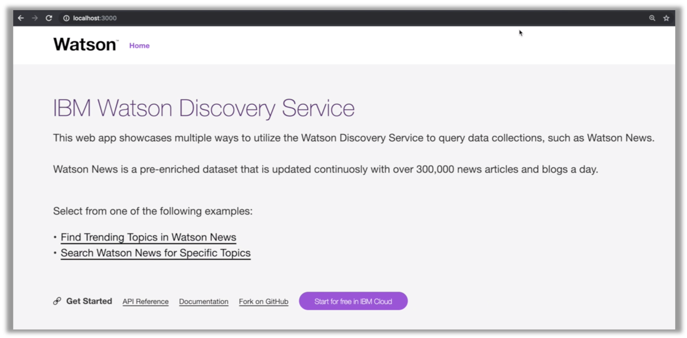
</p>

## Slackチャンネル作成

1. Slackでワークスペース配下の「Channels」の隣の「＋」アイコンをクリックする。
2. 「Name」に任意の名前を入力し「Create」ボタンをクリックする。<br>
※ワークスペースと異なるNameを使用してください

<p align="center">
  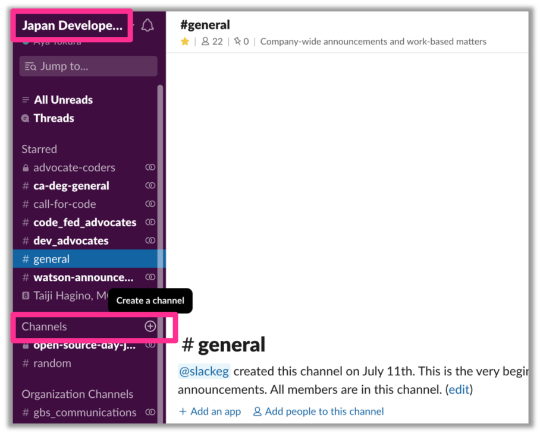
</p>

3. 作成したチャンネルが表示されることを確認する。

## SlackチャンネルへBotの招待

1. Slackのメッセージ入力欄で「@<作成したbot名> こんにちは」と入力し「送信」ボタン
をクリックする。

<p align="center">
  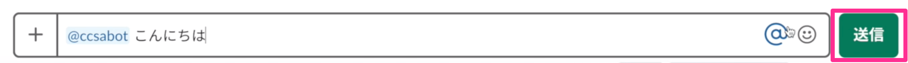
</p>

2. Slackbotが「You mentioned @<入力したbot名>、but they’renot in this channel.(メンションしていますが、このチャンネルには参加していません。)」と自動応答したら「Invite Them(招待する)」ボタンをクリックする。

<p align="center">
  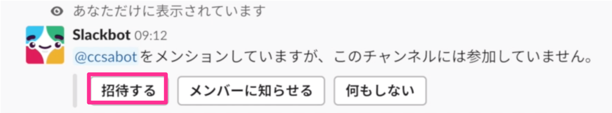
</p>

## Botと会話

1. **「@作成したSlackbot名 <font color="blue">最新ニュースのトレンドを教えて</font>」** と入力し「送信」ボタンを
クリックする。<br>
<font color="red">※ " **最新ニュースのトレンドを教えて**"が一文字でも異なると正しく反応しません。</font>

<p align="center">
  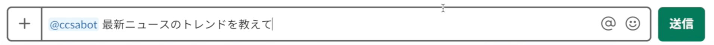
</p>

2. **「どんなニュースに興味がありますか？」** と自動応答が返ってきたら、 **<font color="blue">任意のキーワード</font>** を入力して「送信」ボタンをクリックする。

<p align="center">
  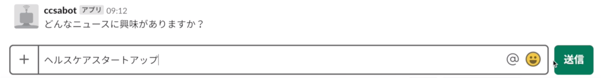
</p>

3. **「調べて欲しいニュースは<font color="blue">任意のキーワード</font>ですね？」** を自動応答が返ってきたら **「<font color="blue">yes</font>」** を入力し、「送信」ボタンをクリックする。

<p align="center">
  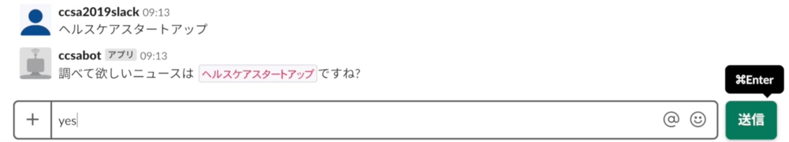
</p>

4. Slack botが **<font color="blue">任意のキーワード</font>** に関するトレンド記事を3つ表示することを確認する。

<p align="center">
  
</p>

5. Slack botの返信した内容の一番最後の行 **「センチメント分析やより詳細は<URL>をご覧ください」** のURLをクリックする。
6. 表示されたサイトで「Sentiments」をクリックするとキーワードに関するニュース記事の
センチメント分析結果が表示される。

<p align="center">
  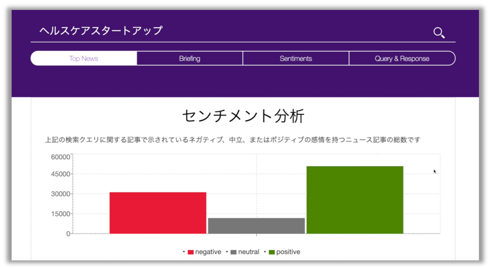
</p>


# Links
* [Visual Studio Code ダウンロードサイト](https://code.visualstudio.com/Download)
* [Node.js サイト (2019/7/24現在、バージョン10.16.0 LTS推奨)](https://nodejs.org/en/)
* [ニュースを検索してトレンドを分析するコグニティブBotソースコード](https://github.com/ayatokura/watson-discovery-news)
* [IBM Cloudダッシュボード](https://ibm.biz/BdzKBB)
* [デモ動画 Youtube（オリジナル）](https://youtu.be/EZGgvci9nC0)

# Learn more

* **Artificial Intelligence Code Patterns**: Enjoyed this Code Pattern? Check out our other [AI Code Patterns](https://developer.ibm.com/code/technologies/artificial-intelligence/).
* **AI and Data Code Pattern Playlist**: Bookmark our [playlist](https://www.youtube.com/playlist?list=PLzUbsvIyrNfknNewObx5N7uGZ5FKH0Fde) with all of our Code Pattern videos
* **With Watson**: Want to take your Watson app to the next level? Looking to utilize Watson Brand assets? [Join the With Watson program](https://www.ibm.com/watson/with-watson/) to leverage exclusive brand, marketing, and tech resources to amplify and accelerate your Watson embedded commercial solution.

# License

[Apache 2.0](LICENSE)
